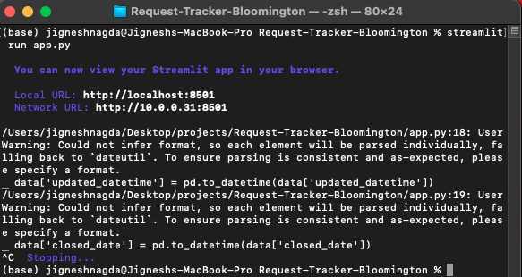
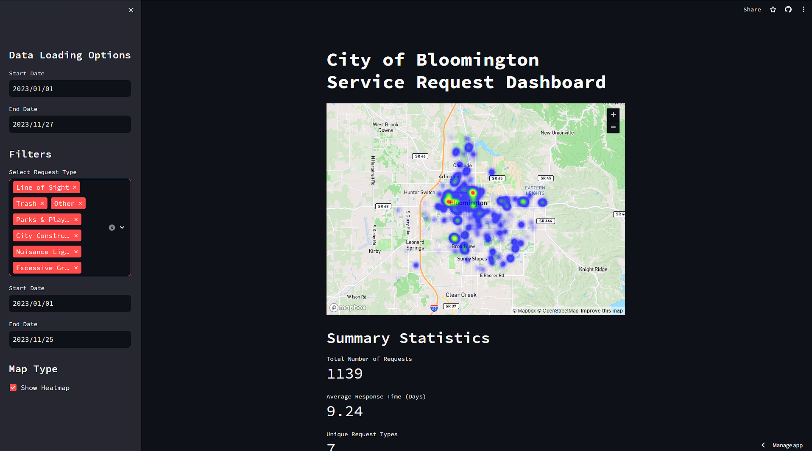
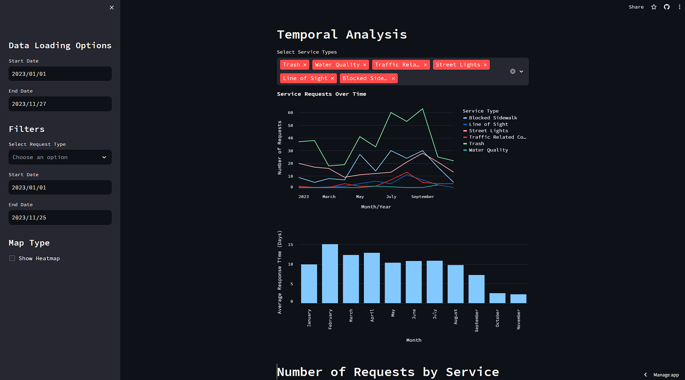
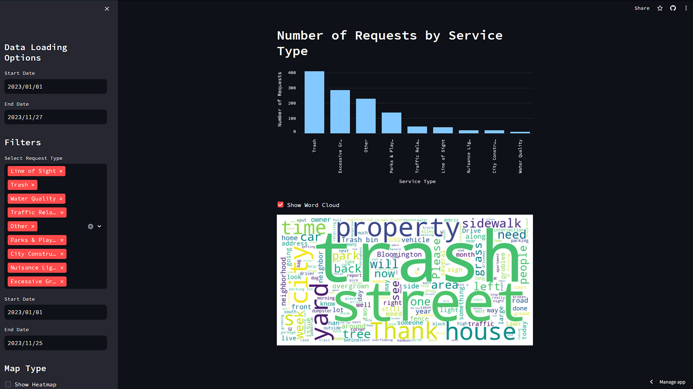

# Request-Tracker-Bloomington

This project introduces a novel solution to the shortcomings of current visualization methods for Bloomington's service requests. Traditional visualizations lack engagement and flexibility, hindering user interaction. To address this, a unified dashboard is proposed, offering residents the ability to visualize various request types and their completion timelines. Through advanced visualization techniques, the user-friendly interface enables efficient exploration of request categories, tracking of completion times, and identification of trends. This innovative approach strives to enhance community engagement, transparency, and informed decision-making in Bloomington's service request management.


## Dataset
The dataset underpinning the Request Tracker Bloomington project is sourced directly from the City of Bloomington's Open311 platform, ensuring transparency and accessibility for all stakeholders. Curated meticulously, this dataset offers a wealth of information vital for effective service request management and community engagement. Featuring a diverse range of columns, including service_request_id, requested_datetime, updated_datetime, closed_date, status_description, source, service_name, description, agency_responsible, address, city, state, zip, lat, long, Georeference, SLA Days, Request Complete Days, and SLA Diff Days, it provides a comprehensive snapshot of Bloomington's service landscape. From the initial submission of service requests to their ultimate resolution, every stage of the process is meticulously documented, enabling thorough monitoring and analysis. 
The dataset can be found at: https://bloomington.data.socrata.com/dataset/Open311/aw6y-t4ix/about_data

## Install Dependencies
Go to the directory containing requirements.txt 
```bash
pip install -r requirements.txt
```

After installing the necessary dependencies, make sure to import the dataset and store it in the base folder of your project directory. 
Note: It's essential to clean the dataset for better visualization and analysis.

## Run the program
After installing the dependencies and having the dataset in the base folder, you can go ahead and execute the program.  
Make sure you are in the directory containing the app.py file and Run the following command line to bring up the server 
```bash
streamlit run app.py
```
If everything went smoothly, you should see the below screen.   
  


If you run into errors, please look online for solutions.

## Few Snippets of the application






## Developers
### Jignesh Nagda | Shiva Pendem | Sricharan Cheeti | Jait Mahavarkar
